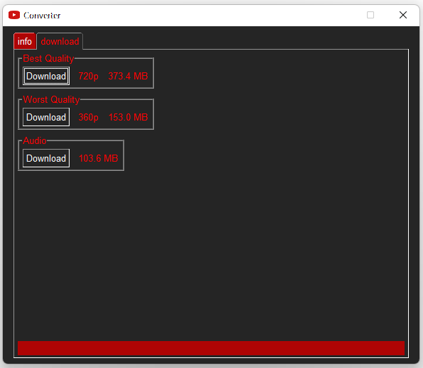
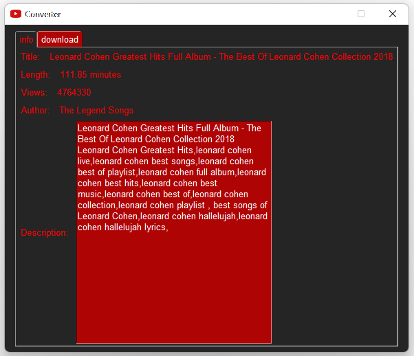

# YouTube Downloader
 Paste the youtube link into the GUI and click 'Submit'
On the download tab choose the quality of video you like . (Based on [PySimpleGUI](https://github.com/PySimpleGUI) framework)

- Input Dialog

   

   ​

- Info Tab

   

   ​

- Download Tab

   

   ​

## Credits

- GitHub: [PySimpleGUI](https://github.com/PySimpleGUI)
- Website: [PySimpleGUI.org](https://PySimpleGUI.org)

